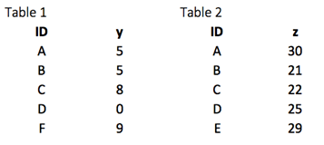
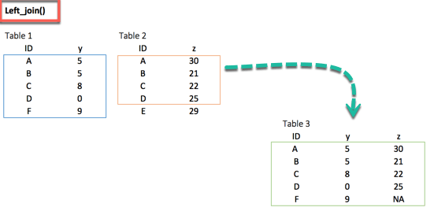
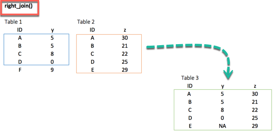
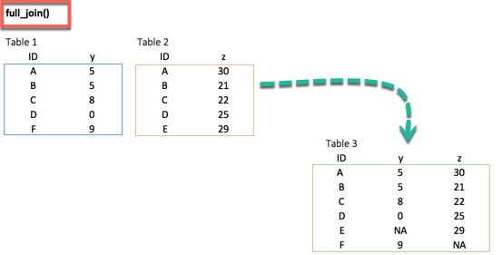
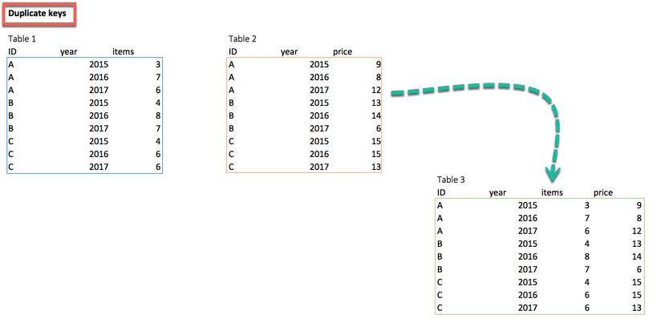
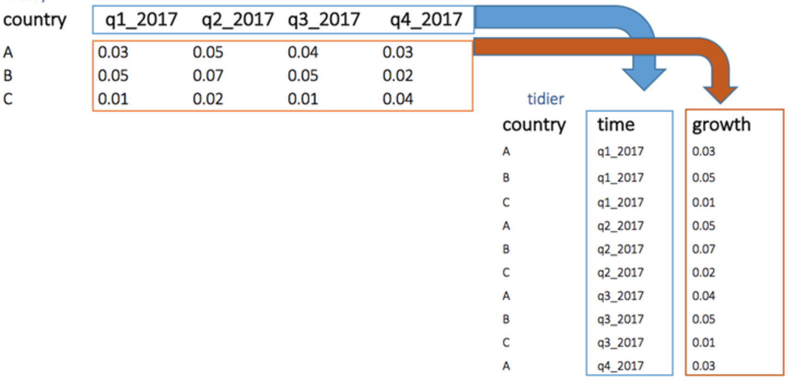

# CrysDA

[](https://github.com/naqvis/CrysDA/actions?query=workflow%3ACrysDA%20CI)
[](https://github.com/naqvis/CrysDA/releases)
[](https://naqvis.github.io/CrysDA/)

`CrysDA` is a **Crys**tal shard for **D**ata **A**nalysis. Provides you modern functional-style API for data manipulation to filter, transform, aggregate and reshape tabular data. Core of the library is `Crysda::DataFrame` an immutable data structure interface.

`CrysDA` is heavily inspired by the amazing [`dplyr`](https://github.com/hadley/dplyr) for [R](https://www.r-project.org/). `CrysDA` is written in pure Crystal and have no external dependencies. It is mimicking the API of `dplyr`, while carefully adding more typed constructs where possible.

## Features


- [X] Filter, transform, aggregate and reshape tabular data
- [X] Modern, user-friendly and easy-to-learn data-science API
- [X] Reads from plain and compressed tsv, csv, json, or any delimited format with or without header from local or remote with auto inferring the types of data.
- [X] Supports reading data from DB
- [X] Supports grouped operations
- [X] Tables can contain atomic columns (Number, Float, Bool, String) as well as object columns
- [X] Reshape tables from wide to long and back
- [X] Table joins (left, right, semi, inner, outer)
- [X] Cross tabulation
- [X] Descriptive statistics (mean, min, max, median, ...)
- [X] Functional API inspired by [dplyr](http://dplyr.tidyverse.org/), [pandas](http://pandas.pydata.org/)

- [X] many more...


## Quick glimpse and comparison with R/dplyr

```crystal
flights = Crysda.read_csv("./spec/data/nycflights.tsv.gz", separator: '\t')

flights
.group_by("year", "month", "day")
.select(
  Crysda.selector { |e| e["year".."day"] }, # columns range
  Crysda.selector { |e| e.list_of("arr_delay", "dep_delay") })
.summarize(
  "mean_arr_delay".with {|s| s["arr_delay"].mean(remove_na: true)},
  "mean_dep_delay".with {|s| s["dep_delay"].mean(true)})
.filter {|f| (f["mean_arr_delay"] > 30) .or (f["mean_dep_delay"] > 30)}
.print("Flights mean delay of arrival and departure")
```
**output**
```shell
Flights mean delay of arrival and departure: 49 x 5
     year   month   day   mean_arr_delay   mean_dep_delay
 1   2013       1    16           34.247           24.613
 2   2013       1    31           32.603           28.658
 3   2013      10     7           39.017           39.147
 4   2013      10    11           18.923           31.232
 5   2013      12     5           51.666           52.328
 6   2013      12     8           36.912           21.515
 7   2013      12     9           42.576           34.800
 8   2013      12    10           44.509           26.465
 9   2013      12    14           46.398           28.362
10   2013      12    17           55.872           40.706
and 39 more rows
```

**And the same snippet written in `dplyr`**
```r
flights %>%
    group_by(year, month, day) %>%
    select(year:day, arr_delay, dep_delay) %>%
    summarise(
        mean_arr_delay = mean(arr_delay, na.rm = TRUE),
        mean_dep_delay = mean(dep_delay, na.rm = TRUE)
    ) %>%
    filter(mean_arr_delay > 30 | mean_dep_delay > 30)
```
---
## Tutorial - Short 1 minute Introduction
For this quick and short tutorial, we will be using [ramen-ratings](https://www.kaggle.com/residentmario/ramen-ratings) dataset from kaggle. You are free to use any of your choice.

```crystal
# load dataset
df = Crysda.read_csv("./spec/data/ramen-ratings.csv")
```
Shard provide support for loading data from CSV, TSV, JSON, DB, URL etc and auto infer the types of columns by peeking into data and make a best choice of data type. Once we’ve read the data into a DataFrame, we can start poking it to see what it looks like. A couple of things one typically look at first are the schema and a few rows.
```crystal
df.print(max_rows: 5) # just show us first 5 rows of data
```
```shell
A DataFrame: 2580 x 7
    Review #            Brand                                                       Variety   Style   Country   Stars   Top Ten
1       2580        New Touch                                     T's Restaurant Tantanmen      Cup     Japan    3.75
2       2579         Just Way   Noodles Spicy Hot Sesame Spicy Hot Sesame Guan-miao Noodles    Pack    Taiwan       1
3       2578           Nissin                                 Cup Noodles Chicken Vegetable     Cup       USA    2.25
4       2577          Wei Lih                                 GGE Ramen Snack Tomato Flavor    Pack    Taiwan    2.75
5       2576   Ching's Secret                                               Singapore Curry    Pack     India    3.75
and 2575 more rows
```
above output shows that our dataset contains 2580 observations (rows) with 7 variables (or they are called columns here)

```crystal
df.schema # show the structure of data.
```

```shell
DataFrame with 2580 observations
Review # [Int32]  2580, 2579, 2578, 2577, 2576, 2575, 2574, 2573, 2572, 2571, 2570, 2569, 2568, 2567, 2566, 2565, 2564...
Brand    [String] New Touch, Just Way, Nissin, Wei Lih, Ching's Secret, Samyang Foods, Acecook, Ikeda Shoku, Ripe'n'Dr...
Variety  [String] T's Restaurant Tantanmen , Noodles Spicy Hot Sesame Spicy Hot Sesame Guan-miao Noodles, Cup Noodles ...
Style    [String] Cup, Pack, Cup, Pack, Pack, Pack, Cup, Tray, Pack, Pack, Pack, Pack, Pack, Bowl, Pack, Cup, Pack, Pa...
Country  [String] Japan, Taiwan, USA, Taiwan, India, South Korea, Japan, Japan, Japan, Singapore, Thailand, USA, South...
Stars    [String] 3.75, 1, 2.25, 2.75, 3.75, 4.75, 4, 3.75, 0.25, 2.5, 5, 5, 4.25, 4.5, 5, 3.5, 3.75, 5, 4, 4, 4.25, 5...
Top Ten  [String] , , , , , , , , , , , , , , , , , , , , , , , , , , , , , , , , , , , , , , , , , , , , , , , , , , ...
```
Already at this point we can notice that for some reason, the ratings (`Stars` column) themselves inferred to be of `String` type. That might be due to some weirdness in the data itself. Exploring various datasets you’ll encounter all sorts of strange things. Some are easy to fix, like in this case. Let's try to see what is causing the problem
```crystal
df.count("Stars").print(max_rows: 15)
```

```shell
A DataFrame: 51 x 2
       Stars     n
 1      3.75   350
 2         1    26
 3      2.25    21
 4      2.75    85
 5      4.75    64
 6         4   384
 7      0.25    11
 8       2.5    67
 9         5   369
10      4.25   143
11       4.5   132
12       3.5   326
13   Unrated     3
14       1.5    37
15      3.25   170
and 36 more rows
```

Turns out three records have a rating of “Unrated”, and since there are so few of them, it’s easier to just drop those records or we can reload the dataset and set the `na_value` argument to `"Unrated"`, entries with this value will then be treated as `nil`. use this approach if you want to treat some values as nil, or you don't want to lose other columns values.

```crystal
df = Crysda.read_csv("./spec/data/ramen-ratings.csv", na_value: "Unrated") # this will retain all rows, while column values with "Unrated" will be treated as `nil`
```

But in this tutorial we are just going to drop those 3 rows and addd new column to dataframe loaded in above step.
```crystal
new_df = df.filter { |f| f["Stars"].matching { |s| !s.starts_with?("Un") } }
  .add_column("Stars_New") { |c| c["Stars"].map { |m| m.to_s.to_f } }.tap(&.schema)
```

```shell
DataFrame with 2577 observations
Review #  [Int32]   2580, 2579, 2578, 2577, 2576, 2575, 2574, 2573, 2572, 2571, 2570, 2569, 2568, 2567, 2566, 2565, 2564...
Brand     [String]  New Touch, Just Way, Nissin, Wei Lih, Ching's Secret, Samyang Foods, Acecook, Ikeda Shoku, Ripe'n'Dr...
Variety   [String]  T's Restaurant Tantanmen , Noodles Spicy Hot Sesame Spicy Hot Sesame Guan-miao Noodles, Cup Noodles ...
Style     [String]  Cup, Pack, Cup, Pack, Pack, Pack, Cup, Tray, Pack, Pack, Pack, Pack, Pack, Bowl, Pack, Cup, Pack, Pa...
Country   [String]  Japan, Taiwan, USA, Taiwan, India, South Korea, Japan, Japan, Japan, Singapore, Thailand, USA, South...
Stars     [String]  3.75, 1, 2.25, 2.75, 3.75, 4.75, 4, 3.75, 0.25, 2.5, 5, 5, 4.25, 4.5, 5, 3.5, 3.75, 5, 4, 4, 4.25, 5...
Top Ten   [String]  , , , , , , , , , , , , , , , , , , , , , , , , , , , , , , , , , , , , , , , , , , , , , , , , , , ...
Stars_New [Float64] 3.750, 1.000, 2.250, 2.750, 3.750, 4.750, 4.000, 3.750, 0.250, 2.500, 5.000, 5.000, 4.250, 4.500, 5....
```
So we added a new column `Stars_New` and we can see that its now of `Float64` type. We can perform simple statistics operations on this column now. Let's just calculate the average rating.
```crystal
# we can either create summary dataframe
new_df.summarize("Average Rating".with {|c| c["Stars_New"].mean}).tap(&.print)
# or we can store the value to some local variable
puts new_df["Stars_New"].mean # => 3.654675979821498
```
Of course, you can have questions to your data that can require some data manipulation, like grouping. For example, let’s find out how many unique Ramen brands are there per country.
```crystal
brands_per_country = new_df
.group_by("Country")
.distinct("Brand")
.group_by("Country")
.count.tap(&.print)
```

```shell
A DataFrame: 31 x 2
         Country    n
 1         Japan   58
 2        Taiwan   47
 3           USA   44
 4         India    7
 5   South Korea   32
 6     Singapore    5
 7      Thailand   22
 8     Hong Kong    9
 9       Vietnam   14
10         Ghana    2
and 21 more rows
```
Let's sort the dataframe on unique brand count in descending order (with highest count on top)
```crystal
brands_per_country.sort_desc_by("n").print
```

```shell
A DataFrame: 31 x 2
         Country    n
 1         Japan   58
 2        Taiwan   47
 3           USA   44
 4   South Korea   32
 5      Malaysia   28
 6         China   22
 7      Thailand   22
 8     Indonesia   18
 9       Vietnam   14
10            UK   11
and 21 more rows
```
These were just a very few and basic examples to give you a taste of what you can do with `Crysda`. As every data wrangler’s path is different, I would encourage you to grab a dataset that interests you and explore it.

---
## Tutorial 2 - Reshaping Data
Data analysis can be divided into three parts
- Extraction : First, we need to collect the data from many sources and combine them.
- Transform: This step involves the data manipulation. Once we have consolidated all the sources of data, we can begin to clean the data.
- Visualize: The last move is to visualize our data to check irregularity.

One of the most significant challenges faced by data scientist is the data manipulation. Data is never available in the desired format. The data scientist needs to spend at least half of his time, cleaning and manipulating the data. That is one of the most critical assignments in the job. If the data manipulation process is not complete, precise and rigorous, the model will not perform correctly.

### Merging(joining) Data
CrysDA provides a nice and convenient way to combine datasets. We may have many sources of input data, and at some point, we need to combine them. A join with CrysDA adds variables to the right of the original dataset. The beauty is CrysDA is that it handles four types of joins similar to SQL

- Left join
- right join
- inner join
- outer join

We will study all the joins types via an easy example.

First of all, we build two datasets. Table 1 contains two variables, ID, and y, whereas Table 2 gathers ID and z. In each situation, we need to have a key-pair variable. In our case, ID is our key variable. The function will look for identical values in both tables and bind the returning values to the right of table 1.


```crystal
df_primary = Crysda.dataframe_of("ID","y").values(
  "A", 5,
   "B", 5,
   "C", 8,
   "D", 0,
  "F", 9
)

df_secondary = Crysda.dataframe_of("ID","z").values(
  "A", 30,
   "B", 21,
   "C", 22,
   "D", 25,
   "E", 29
)
```

#### left_join()

The most common way to merge two datasets is to use the `left_join` function. We can see from the picture below that the key-pair matches perfectly the rows A, B, C and D from both datasets. However, E and F are left over. How do we treat these two observations? With the `left_join`, we will keep all the variables in the original table and don't consider the variables that do not have a key-paired in the destination table. In our example, the variable E does not exist in table 1. Therefore, the row will be dropped. The variable F comes from the origin table; it will be kept after the `left_join` and return NA in the column z. The figure below reproduces what will happen with a `left_join`.


```crystal
df_primary.left_join(df_secondary, "ID").print("Left Join")
```
Output:

```shell
Left Join: 5 x 3
    ID   y      z
1    A   5     30
2    B   5     21
3    C   8     22
4    D   0     25
5    F   9   <NA>
```

#### right_join()

The `right_join` function works exactly like `left_join`. The only difference is the row dropped. The value E, available in the destination data frame, exists in the new table and takes the value NA for the column y.


```crystal
df_primary.right_join(df_secondary, "ID").print("Right Join")
```

Output:

```shell
Right Join: 5 x 3
    ID      y    z
1    A      5   30
2    B      5   21
3    C      8   22
4    D      0   25
5    E   <NA>   29
```

#### inner_join()

When we are 100% sure that the two datasets won't match, we can consider to return only rows existing in both dataset. This is possible when we need a clean dataset or when we don't want to impute missing values with the mean or median.

The `inner_join` comes to help. This function excludes the unmatched rows.


```crystal
df_primary.inner_join(df_secondary, "ID").print("Inner Join")
```

Output:

```shell
Inner Join: 4 x 3
    ID   y    z
1    A   5   30
2    B   5   21
3    C   8   22
4    D   0   25
```

#### outer_join()
Finally, the `outer_join` function keeps all observations and replace missing values with `NA`.


```crystal
df_primary.outer_join(df_secondary, "ID").print("Outer Join")
```
Output:

```shell
Outer Join: 6 x 3
    ID      y      z
1    A      5     30
2    B      5     21
3    C      8     22
4    D      0     25
5    E   <NA>     29
6    F      9   <NA>
```

#### Multiple keys pairs

We can have multiple keys in our dataset. Consider the following dataset where we have a years or a list of products bought by the customer.


```crystal
df_primary = Crysda.dataframe_of("ID","year","items").values(
  "A", 2015,3,
  "A", 2016,7,
  "A", 2017,6,
  "B", 2015,4,
  "B", 2016,8,
  "B", 2017,7,
  "C", 2015,4,
  "C", 2016,6,
  "C", 2017,6
)

df_secondary = Crysda.dataframe_of("ID","year","prices").values(
  "A", 2015,9,
  "A", 2016,8,
  "A", 2017,12,
  "B", 2015,13,
  "B", 2016,14,
  "B", 2017,6,
  "C", 2015,15,
  "C", 2016,15,
  "C", 2017,13
)

df_primary.left_join(df_secondary, by: ["ID","year"]).print("Multikey Join")
```

Output:

```shell
Multikey Join: 9 x 4
    ID   year   items   prices
1    A   2015       3        9
2    A   2016       7        8
3    A   2017       6       12
4    B   2015       4       13
5    B   2016       8       14
6    B   2017       7        6
7    C   2015       4       15
8    C   2016       6       15
9    C   2017       6       13
```

### Data Cleaning functions
Following are four important functions to tidy the data:

- gather: Transform the data from wide to long
- spread: Transform the data from long to wide
- separate: Split one variable into multiples
- unite: Unite multiple variables into one

#### gather()
The objectives of the `gather` function is to transform the data from wide to long.

Below we can visualize the concept of reshaping wide to long. We want to create a single column named growth, filled by the rows of the quarter variables.


```crystal
# Create a dataset
df = Crysda.dataframe_of("country", "q1_2017", "q2_2017", "q3_2017", "q4_2017").values(
  "A", 0.03, 0.05, 0.04, 0.03,
  "B", 0.05, 0.07, 0.05, 0.02,
  "C", 0.01, 0.02, 0.01, 0.04)
df.print
```
Output:

```shell
A DataFrame: 3 x 5
    country   q1_2017   q2_2017   q3_2017   q4_2017
1         A     0.030     0.050     0.040     0.030
2         B     0.050     0.070     0.050     0.020
3         C     0.010     0.020     0.010     0.040
```

Reshape the data

```crystal
reshaped = df.gather("quarter","growth", Crysda.selector{|c| c["q1_2017".."q4_2017"]}).tap(&.print(max_rows: 12))
```

Output:

```shell
A DataFrame: 12 x 3
     country   quarter   growth
 1         A   q1_2017    0.030
 2         B   q1_2017    0.050
 3         C   q1_2017    0.010
 4         A   q2_2017    0.050
 5         B   q2_2017    0.070
 6         C   q2_2017    0.020
 7         A   q3_2017    0.040
 8         B   q3_2017    0.050
 9         C   q3_2017    0.010
10         A   q4_2017    0.030
11         B   q4_2017    0.020
12         C   q4_2017    0.040
```

In the `gather` function, we created two new variables **qurater** and **growth** because our original dataset has one group variable: **country** and the key-value pairs.

#### spread()
The `spread` function does the opposite of `gather`. We can reshape data in above example back to its original form.

```crystal
reshaped.spread("quarter","growth").print
```

Output:

```shell
A DataFrame: 3 x 5
    country   q1_2017   q2_2017   q3_2017   q4_2017
1         A     0.030     0.050     0.040     0.030
2         B     0.050     0.070     0.050     0.020
3         C     0.010     0.020     0.010     0.040
```

#### separate()
The `separate` function splits a column into multiples according to a separator. This function is helpful in some situations where the variable is a list of values seprated by a separator. For example, our analysis require focusing on month and year and we want to separate the column into two new variables.

```crystal
reshaped.separate("quarter", into: ["Qtr","Year"], sep: "_").print("Separated", max_rows: 12)
```

Output:

```shell
Separated: 12 x 4
     country   growth   Qtr   Year
 1         A    0.030    q1   2017
 2         B    0.050    q1   2017
 3         C    0.010    q1   2017
 4         A    0.050    q2   2017
 5         B    0.070    q2   2017
 6         C    0.020    q2   2017
 7         A    0.040    q3   2017
 8         B    0.050    q3   2017
 9         C    0.010    q3   2017
10         A    0.030    q4   2017
11         B    0.020    q4   2017
12         C    0.040    q4   2017
```

#### unite()
The `unite` function concatenate multiple columns into one.

```crystal
separated.unite("Quarter",["Qtr","Year"], sep: "_").print("United")
```

Output:

```shell
     country   growth   Quarter
 1         A    0.030   q1_2017
 2         B    0.050   q1_2017
 3         C    0.010   q1_2017
 4         A    0.050   q2_2017
 5         B    0.070   q2_2017
 6         C    0.020   q2_2017
 7         A    0.040   q3_2017
 8         B    0.050   q3_2017
 9         C    0.010   q3_2017
10         A    0.030   q4_2017
and 2 more rows
```
---
## Installation

1. Add the dependency to your `shard.yml`:

```yaml
   dependencies:
     crysda:
       github: naqvis/CrysDA
```

2. Run `shards install`

## Usage

```crystal
require "crysda"

# Read tab-delimited data-frame from disk
df = Crysda.read_csv("data/iris.txt", separator: '\t')

# Read data-frame from URL
df = Crysda.read_csv("http://url/file.csv")

# Create data-frame in memory
df = Crysda.dataframe_of("first_name", "last_name", "age", "weight", "adult").values(
  "Max", "Doe", 23, 55.8, true,
  "Franz", "Smith", 23, 88.3, true,
  "Horst", "Keanes", 12, 82.5, false,
)

# print rows
df.print

# print structure of data-frame
df.schema

# Subset columns with select/reject
df.select("last_name", "weight")
df.reject("weight", "age")
df.select(&.ends_with?("name"))
df.select? { |v| v.is_a?(Crysda::Int32Col) }
df.select? { |v| v.name.starts_with?("foo") }

# Subset rows with filter
df.filter { |e| e.["age"] == 23 }
df.filter { |e| e.["weight"] > 50 }
df.filter { |e| e["first_name"].matching { |e| e.starts_with?("Ho") } }

# Sort your data
df.sort_by("age")
# and add secondary sorting attribute as variadic param
df.sort_by("age", "weight")
# sort in descending order
df.sort_desc_by("age")
df.sort_by { |e| e["weight"] }

# add columns with mutate
# by adding constant values as new column
df.add_column("salary_category") { 3 }

# by doing basic column arithmetics
df.add_column("age_3y_later") { |e| e["age"] + 3 }

# Note: dataframes are immutable so we need to (re)assign results to preserve changes.
new_df = df.add_column("full_name") { |e| e["first_name"] + " " + e["last_name"] }

# Also feel free to mix types
df.add_column("user_id") { |e| e["last_name"] + "_id" + e.row_num }

# add multiple columns at once
df.add_columns(
  "age_plus3".with { |e| e["age"] + 3 },
  "initials".with { |e| e["first_name"].map(&.to_s[0]).concatenate(e["last_name"].map(&.to_s[0])) })

# Summarize

# do simple cross tabulations
df.count("age", "last_name")

# or calculate single summary statistic
df.summarize("min_age") { |e| e["age"].min }
# or
df.summarize(
  "min_age".with { |e| e["age"].min },
  "max_age".with { |e| e["age"].max },
  "mean_weight".with { |e| e["weight"].mean },
)

# Group operations
grouped_df = df.group_by("age") # or provide multiple grouping attributes
grouped_df.summarize(
  "mean_weight".with { |e| e["weight"].mean(remove_na: true) },
  "num_persons".with {|e| e.num_row}
)

# optionally ungroup the data
grouped_df.ungroup.print

# Join operations
a = Crysda.dataframe_of("name", "project_id").values(
  "Max", "P1",
  "Max", "P2",
  "Tom", "P3"
)

b = Crysda.dataframe_of("title", "project_id").values(
  "foo", "P1",
  "some_title", "P2",
  "alt_title", "P2"
)

a.left_join(b, by: "project_id").print
a.outer_join(b).print

df = Crysda.dataframe_of("foo", "bar").values(
  "a", 2,
  "b", 3,
  "c", 4
)

# join on foo
df.inner_join(df, by: "foo", suffices: {"_1", "_2"}).tap do |d|
  d.print
end

# again but now join on bar. Join columns are expected to come first
df.inner_join(df, "bar", {"_1", "_2"})

# again but now join on nothing
df.inner_join(df, [] of String, {"_1", "_2"})

# Reshape data
df = Crysda.dataframe_of("person", "year", "weight", "sex").values(
  "max", 2014, 33.1, "M",
  "max", 2015, 32.3, "M",
  "max", 2016, nil, "M",
  "anna", 2013, 33.5, "F",
  "anna", 2014, 37.3, "F",
  "anna", 2015, 39.2, "F",
  "anna", 2016, 39.9, "F"
)
df.schema
df.spread("year", "weight").print

df = Crysda.dataframe_of("person", "property", "value", "sex").values(
  "max", "salary", "33.1", "M",
  "max", "city", "London", "M",
  "anna", "salary", "33.5", "F",
  "anna", "city", "Berlin", "F"
)
wide_df = df.spread("property", "value")

wide_df.gather("property", "value", Crysda::ColumnSelector.new { |x| (x.except("person")).and x.starts_with?("person") })

wide_df.gather("property", "value", Crysda::ColumnSelector.new { |x| x.except("person") })

wide_df.gather("property", "value", Crysda::ColumnSelector.new { |x| x.except("person") })
  .tap do |wf|
    wf.print
    annual_salary = wf.filter { |x| (x["person"] == "anna").and (x["property"] == "salary") }
    annual_salary.print
  end
```
**.....**

Unable to cover each and every functionality in this README. So refer to `specs` for more sample usages and API documentation for all available functionality.

## Development

To run all tests:

```
crystal spec
```

## Contributing

1. Fork it (<https://github.com/naqvis/Crysda/fork>)
2. Create your feature branch (`git checkout -b my-new-feature`)
3. Commit your changes (`git commit -am 'Add some feature'`)
4. Push to the branch (`git push origin my-new-feature`)
5. Create a new Pull Request

## Contributors

- [Ali Naqvi](https://github.com/naqvis) - creator and maintainer

